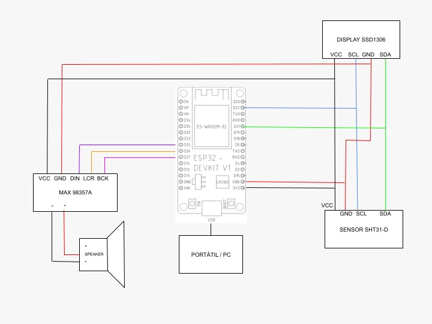
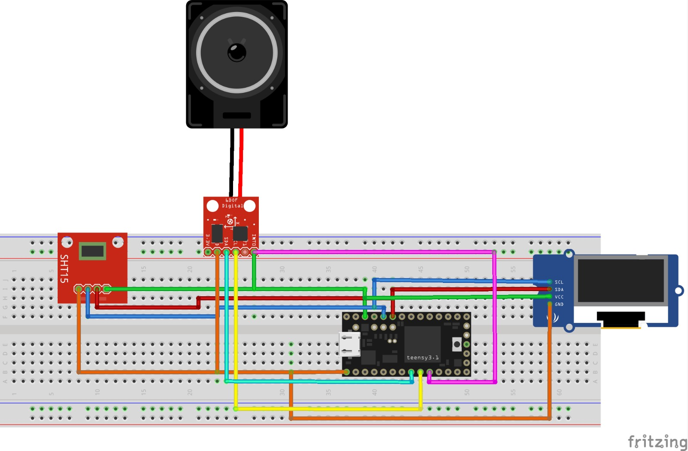
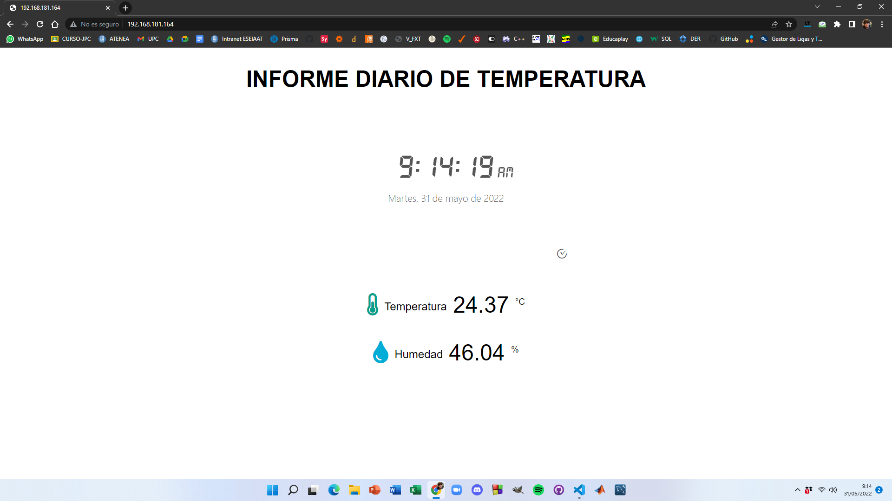

# <div style="text-align: center "> Procesadores Digitales </div> 
# <div style="text-align: justify "> Proyecto Siri de la Temperatura & Humedad con WebServer  IP  </div>

# 1. Miembros del proyecto
### <div style="text-align: justify "> Gisela León Pipó  </div>
### <div style="text-align: justify "> Joan Marc Fuentes Soler  </div>

# 2. Definición del proyecto
### <div style="text-align: justify ">  Nuestro proyecto consiste en hacer un informe por voz donde nos avisará cada hora de la temperatura ambiental (mediante un sensor de temperatura), la hora y el día. Además, podremos visualizar los datos por un display y el servidor nos crea una página web con toda esta información. </div>

# 3. Distribución de trabajo

### <div style="text-align: justify "> En este proyecto nos hemos distribuido las tareas de la siguiente manera: </div> 

### <div style="text-align: justify "> Gisela se ha encargado de generar un servidor web mediante una dirección IP para mostrar la Temperatura & Humedad mediante el sensor SHT31-D y con la fecha y hora local de España GMT +2. </div> 

### <div style="text-align: justify ">  Joan-Marc se ha encargado de hacer la distribución de la pantalla del display SSD1306 con su información correspondiente y por último sacar la información de la Temperatura & Humedad mediante un audio del altavoz. </div>

<div style="page-break-after: always;"></div>

# 4. Diagrama de bloques

### <div style="text-align: justify "> En las siguientes imagenes podemos observar los diagramas de bloques de nuestro proyecto y que elementos tenemos y como estan conectado entre si.  </div>



<div style="page-break-after: always;"></div>



<div style="page-break-after: always;"></div>

# 5. Funcionamiento

### <div style="text-align: justify "> Primero de todo hay que añadir las librerías y extensiones necesarias: </div>
```c++ 
    #include <Arduino.h>
    #include <NTPClient.h>          // Liberia Fecha i Hora Local
    #include <WiFiUdp.h>            // Liberia Fecha i Hora Local
    #include <WiFi.h>               // Liberia Fecha i Hora Local
    #include "AsyncTCP.h"           // Web Server 
    #include <DNSServer.h>          // Web Server 
    #include "ESPAsyncWebServer.h"  // Web Server 
    #include <Wire.h>               // Only needed for Arduino 1.6.5 and earlier
    #include "Audio.h"              // Libreria Audio ESP32-audioI2S-master 
    #include "ClosedCube_SHT31D.h"  // Liberia Sensor de Temperatura  SHT31-D
    #include "SSD1306Wire.h"        // Liberia Display SSD1306
```
### <div style="text-align: justify "> Seguidamente definimos las variables: En primer lugar, definimos los pines I/O ESP32 que conectan al altavoz </div>
```c++ 
    #define I2S_DOUT      25
    #define I2S_BCLK      27
    #define I2S_LRC       26
```
### <div style="text-align: justify "> Después definimos la variable audio del tipo Audio: </div>
```c++
    Audio audio;
```
### <div style="text-align: justify "> Para conectarnos a la red (hay que reemplazar el nombre en cada caso): </div>
```c++ 
    String ssid = "HUAWEI P30 lite";
    String password = "berta056";
```
### <div style="text-align: justify "> Las del Web Server </div>
```c++ 
    DNSServer dnsServer;
    AsyncWebServer server(80);
```
<div style="page-break-after: always;"> </div>

### <div style="text-align: justify "> El Display: </div>
```c++ 
    SSD1306Wire display(0x3c, SDA, SCL);
```
### <div style="text-align: justify "> El sensor de temperatura y humedad: </div>
```c++ 
    ClosedCube_SHT31D sht31 = ClosedCube_SHT31D();
    SHT31D result;
```
### <div style="text-align: justify "> El día y hora local:  </div>
```c++ 
    WiFiUDP ntpUDP;
    NTPClient timeClient(ntpUDP);
    String formattedDate;
```
### <div style="text-align: justify "> Variables de la temperatura y la humedad</div>
```c++ 
    float temp;
    float humd;
```
### <div style="text-align: justify "> 3 Contadores que usaremos más adelante:  </div>
```c++ 
    int contAudio=0; int mult=0; int cont=0;
```
### <div style="text-align: justify "> Las dos tareas que vamos a usar:  </div>
```c++ 
    void AudioLoopTask(void *parameter);
    void MainTHTask(void *parameter);
```
### <div style="text-align: justify "> Las tres funciones que realizaremos:  </div>
```c++ 
    void AudioOut();
    void OutTerminal();
    void OutDisplay();
```
### <div style="text-align: justify "> Una vez definidas todas las variables, definimos dos funciones de lectura de la temperatura y de la humedad readSHT31Temperature() y readSHT31Humidity(). </div>
```c++ 
    String readSHT31Temperature(){
    float t = result.t;    
        return String(t);
    }
    String readSHT31Humidity() {
    float h = result.rh;
        return String(h);
    }
```
### <div style="text-align: justify "> A continuación creamos la página WebServer con el código obtenido en las prácticas de laboratorio en la que podremos ver la Temperatura & Humedad, pero también la Fecha & Hora Local, en este caso será la de España GMT +2. </div>
### <div style="text-align: justify "> Primero definimos el estilo de las letras, la alineación, el tamaño...</div>
```c++ 
    // Pagina WebServer
    const char index_html[] PROGMEM = R"rawliteral(
    <!DOCTYPE HTML><html>
    <head>
    <meta name="viewport" content="width=device-width, initial-scale=1">
    <link rel="stylesheet" href="https://use.fontawesome.com/releases/v5.7.2/css/all.css" integrity="sha384-fnmOCqbTlWIlj8LyTjo7mOUStjsKC4pOpQbqyi7RrhN7udi9RwhKkMHpvLbHG9Sr" crossorigin="anonymous">
    <style>
        html {
        font-family: Arial;
        display: inline-block;
        margin: 0px auto;
        text-align: center;
        }
        h2 { font-size: 3.0rem; }
        p { font-size: 3.0rem; }
        .units { font-size: 1.2rem; }
        .sht31-labels{
        font-size: 1.5rem;
        vertical-align:middle;
        padding-bottom: 15px;
        }
    </style>
    </head>
```
### <div style="text-align: justify "> Luego, hay que crear lo que sería el “cuerpo”, con toda la información que queremos poner en la página web. </div>
### <div style="text-align: justify ">Ponemos un título de cabecera </div>
```c++
    <body>
    <h2>INFORME DIARIO DE TEMPERATURA</h2>
    <p>
```
### <div style="text-align: justify "> La siguiente parte nos permite acceder a un reloj digital sacado de un enlace de internet.  </div>
```c++
    <iframe width="550" height="325" src="https://reloj-alarma.com/embed/#theme=0&m=0&showdate=1" frameborder="0" allowfullscreen>
    </iframe>
    </p>
```
### <div style="text-align: justify "> Los siguientes dos párrafos son para poner los datos de la temperatura y la humedad. </div>
```c++
    <p>
        <i class="fas fa-thermometer-half" style="color:#059e8a;"></i>
        <span class="sht31-labels">Temperatura</span>
        <span id="temperature">%TEMPERATURE%</span>
        <sup class="units">&deg;C</sup>
    </p>
    <p>
        <i class="fas fa-tint" style="color:#00add6;"></i>
        <span class="sht31-labels">Humedad</span>
        <span id="humidity">%HUMIDITY%</span>
        <sup class="units">%</sup>
    </p>
    </body>
    <script>
    setInterval(function ( ) {
    var xhttp = new XMLHttpRequest();
    xhttp.onreadystatechange = function() {
        if (this.readyState == 4 && this.status == 200) {
        document.getElementById("temperature").innerHTML = this.responseText;
        }
    };
    xhttp.open("GET", "/temperature", true);
    xhttp.send();
    }, 10000 ) ;
    
    setInterval(function ( ) {
    var xhttp = new XMLHttpRequest();
    xhttp.onreadystatechange = function() {
        if (this.readyState == 4 && this.status == 200) {
        document.getElementById("humidity").innerHTML = this.responseText;
        }
    };
    xhttp.open("GET", "/humidity", true);
    xhttp.send();
    }, 10000 ) ;
    </script>
    </html>)rawliteral";
```
### <div style="text-align: justify "> La página web quedaría entonces de la siguiente manera: </div>




### <div style="text-align: justify "> Una vez generado toda la página web tenemos que remplazar los valores con la SHT31-D.  </div>
```c++ 
    String processor(const String& var){
        if(var == "TEMPERATURE"){ return readSHT31Temperature(); }
        else if(var == "HUMIDITY"){ return readSHT31Humidity(); }
    return String();
    }
```
<div style="page-break-after: always;"> </div>

### <div style="text-align: justify "> Ahora, en el setup, inicializamos nuestro Serial a la velocidad correspondiente a la placa ESP32, el display, el sensor y nos conectamos a la wifi tanto para la página web como la fecha y hora local. </div> 
### <div style="text-align: justify "> A continuación creamos dos Tareas en cada una de las CPU de la placa para separar nuestras dos tareas, el audio y la información del sensor de Temperatura & Humedad. </div>
+ La tarea AudioLoopTask (CPU 0) 
+ La tarea MainTHTask (CPU 1) 
```c++ 
        void setup() {
        Serial.begin(115200);
        Wire.begin();
        // Initialising the UI will init the display too.
        Serial.println(" ");
        Serial.println("ClosedCube SHT3X-D Periodic Mode Example");
        Serial.println("supports SHT30-D, SHT31-D and SHT35-D");
        sht31.begin(0x44); // I2C address: 0x44 or 0x45
        Serial.print("Serial #");
        Serial.println(sht31.readSerialNumber());
        if (sht31.periodicStart(SHT3XD_REPEATABILITY_HIGH, SHT3XD_FREQUENCY_10HZ) != SHT3XD_NO_ERROR{
            Serial.println("[ERROR] Cannot start periodic mode");
        }
        display.init();
        display.flipScreenVertically();
        display.setFont(ArialMT_Plain_10);
        WiFi.disconnect();
        WiFi.mode(WIFI_STA);
        WiFi.begin(ssid.c_str(), password.c_str());
        Serial.print("Conectando...");
        Serial.println(ssid);
        while (WiFi.status() != WL_CONNECTED) delay(1500);
```
<div style="page-break-after: always;"> </div>  

```c++ 
        Serial.println(".");
        Serial.println(WiFi.status());
        audio.setPinout(I2S_BCLK, I2S_LRC, I2S_DOUT);
        audio.setVolume(21); // 0...21

        // Print ESP32 Local IP Address
        Serial.println(WiFi.localIP());
        timeClient.begin();
        timeClient.setTimeOffset(7200);
        // Route for root / web page
        server.on("/", HTTP_GET, [](AsyncWebServerRequest *request){
            request->send_P(200, "text/html", index_html, processor);
        });
        server.on("/temperature", HTTP_GET, [](AsyncWebServerRequest *request){
            request->send_P(200, "text/plain", readSHT31Temperature().c_str());
        });
        server.on("/humidity", HTTP_GET, [](AsyncWebServerRequest *request){
            request->send_P(200, "text/plain", readSHT31Humidity().c_str());
        });
        xTaskCreatePinnedToCore(
            AudioLoopTask, /* Task function. */
            "AudioLoopTask", /* name of task. */
            10000, /* Stack size of task */
            NULL, /* parameter of the task */
            1, /* priority of the task */
            NULL,
            0); /* Task handle to keep track of created task */
    
        xTaskCreatePinnedToCore(
            MainTHTask, /* Task function. */
            "MainTHTask", /* name of task. */
            10000, /* Stack size of task */
            NULL, /* parameter of the task */
            1, /* priority of the task */
            NULL,
            1); /* Task handle to keep track of created task */
        // Start server
        Serial.println("Server begin");
        server.begin();
        Serial.println("End server");
        }
```
    
### <div style="text-align: justify "> Finalmente, acabamos empezando el servidor hasta que se cierra la terminal. </div>

<div style="page-break-after: always;"> </div>

### <div style="text-align: justify "> En el loop solo tenemos un delay para que tenga tiempo de procesar la siguiente tarea y para que no se colapse. </div>
```c++ 
    void loop(){
    delay(1000);  
    }
```
### <div style="text-align: justify "> En la tarea AudioLoopTask que es un bucle infinito, simplemente hacemos que audio se repita siempre y cuando se necesite el audio.   </div>
```c++ 
    void AudioLoopTask(void * parameter ){
    /* loop forever */
    Serial.println("this is another TaskLoopAudio");
    for(;;){
        audio.loop();
        delay(1);
    }
    /* delete a task when finish,
    this will never happen because this is infinity loop */
    vTaskDelete( NULL );
    }
```

### <div style="text-align: justify "> En la tarea MainTHTask que es un bucle infinito , recibimos la hora y fecha local y también las variables de la temperatura y la humedad del sensor. </div>
### <div style="text-align: justify "> A continuación llamamos diferentes funciones como OutTerminal, OutDisplay y AudioOut que son los que sacan la información en el display con la temperatura y humedad correspondiente en ese lugar y lo mismo, pero por la terminal del PC y por último saca el audio correspondiente en el momento indicado. </div>
```c++ 
    void MainTHTask(void * parameter ){
    /* loop forever */
    Serial.println("this is another TaskLoopTH");
    for(;;){
        result = sht31.periodicFetchData();
    while(!timeClient.update()) { timeClient.forceUpdate(); }
    delay(100);
    // The formattedDate comes with the following format:
    // 16:00:13 28-05-2018  
    // We need to extract date and time
    formattedDate = timeClient.getFormattedTime();
    //Serial.println(formattedDate);

    SHT31D result = sht31.periodicFetchData();
    humd = result.rh;
    temp = result.t;
    delay(300);
    OutTerminal();
    Serial.println();
    OutDisplay(); 
    delay(700);
    Serial.print("Analisis de temperatura número: ");
    Serial.print(contAudio);
    Serial.println();

    if(contAudio == mult){
        mult = mult+25;
        AudioOut();
    }
    contAudio++;
    
    }
    /* delete a task when finish,
    this will never happen because this is infinity loop */
    vTaskDelete( NULL );
    }
```
### <div style="text-align: justify "> En esta función OutTerminal sacamos la información correspondiente del display pero por la terminal.  </div>
```c++ 
    void OutTerminal(){
    Serial.print("-------------------------------------\n");
    Serial.print("Informe de la Temperatura y la humedad\n");
    Serial.print("\nDATA & HORA LOCAL GMT +2\n");
    Serial.println(timeClient.getFormattedDate());
    Serial.print("Temperatura:");
    Serial.print(temp,1);
    Serial.print("ºC\n");
    Serial.print("Humedad:");
    Serial.print(humd,1);
    Serial.print("%\n");
    Serial.print("-------------------------------------");
    Serial.println();
    delay(1);
    }
```
<div style="page-break-after: always;"> </div>

### <div style="text-align: justify "> En esta función OutDisplay sacamos la información correspondiente por el display. </div>
```c++ 
    void OutDisplay(){
    // Esborra la pantalla
    display.clear();
    display.setTextAlignment(TEXT_ALIGN_CENTER);
    display.setFont(ArialMT_Plain_10);
    display.drawString(60,0,"INFORME DIARIO");
    display.setFont(ArialMT_Plain_10);
    display.drawString(60,10, "TEMPERATURA : " + String(temp) +"ºC");
    display.setFont(ArialMT_Plain_16);
    display.setFont(ArialMT_Plain_10);
    display.drawString(60, 20, "HUMEDAD : " + String(humd) +"%");
    display.setFont(ArialMT_Plain_16);
    display.drawHorizontalLine(0,32,128);
    display.setFont(ArialMT_Plain_10);
    display.drawString(60,34,"D/H LOCAL GMT +2");
    display.setFont(ArialMT_Plain_10);
    display.drawString(60,44,String(timeClient.getFormattedDate()));
    display.setFont(ArialMT_Plain_10);
    display.drawString(60,54,"IP:"+ WiFi.localIP().toString());
    // Escrivim el buffer a la pantalla 
    display.display();
    }
```
### <div style="text-align: justify "> En esta función AudioOut sacamos la información correspondiente por el altavoz.  </div>
```c++
    void AudioOut(){
        char buffer[150];
        if(cont!=0){
            audio.stopSong();
        }
        sprintf(buffer,"la temperatura ambiental es de %s grados centígrados y la humedad es de %s por ciento",String(temp),String(humd));
        Serial.println(buffer);
        audio.connecttospeech(buffer,"es");
        delay(10000);
        if(temp > 25.00){
            delay(1000);
            audio.connecttospeech("Hace mucho calor. Le recomendamos encender el aire acondicionado","es");
            delay(5000);
        }
```
<div style="page-break-after: always;"> </div>

```c++ 
        else if(temp < 15.00){
            delay(1000);
            audio.connecttospeech("Hace mucho frío. Le recomendamos encender la calefacción","es");
            delay(5000);
        }
        cont++;
    }
```