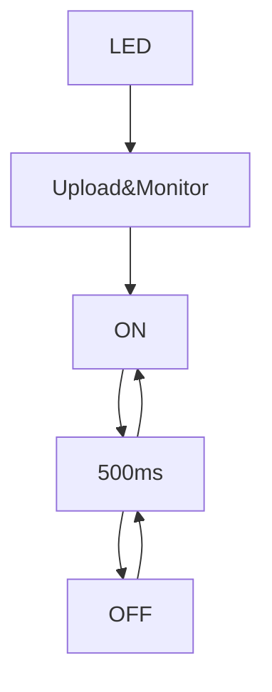
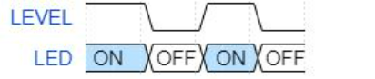

# **INFORME PRÀCTICA 1**
## **CODI** ## 
```c++
    #include <Arduino.h>  
    #define LED 16  

    void setup() {          
      Serial.begin(9600);  
      pinMode(LED,OUTPUT); 
    }

    void loop() {    
      digitalWrite(LED,HIGH);
      Serial.println("ON");  
      delay(500);  
      digitalWrite(LED,HIGH);  
      Serial.println("OFF"); 
      digitalWrite(LED,LOW);  
      delay(500);
    }
```

## **DIAGRAMA DE FLUX** ##

## **DIAGRAMA DE TEMPS** ##


## **VIDEO DE L'EXECUCIÓ** ##
https://drive.google.com/file/d/1gKX1zMaDqwXoT7LolWSpV_evjQBEuUE5/view?usp=sharing
## **GRÀFIC** ##
https://drive.google.com/file/d/1KLLkH3HYpIhNRDVJHgdddw3QXtxMLRIM/view?usp=sharing