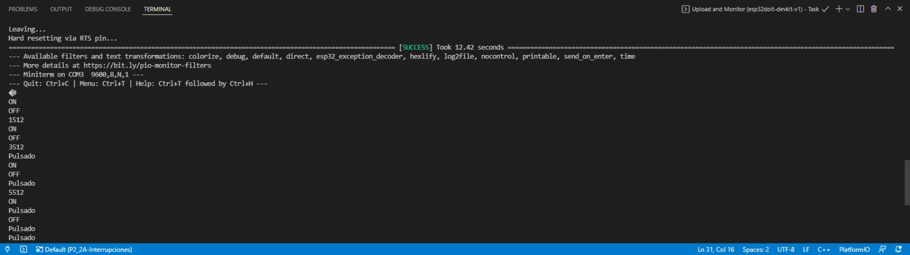

# **INFORME PRÀCTICA 2_1** #

## **CODI** ##
```c++
        #include <Arduino.h>

        #define LED 16  
        unsigned long myTime;  
        #define interruptPin 0    

        void serialPin();  
        void QuitarPin();

        void setup() {    
            Serial.begin(9600); 
            pinMode(LED,OUTPUT);  
            attachInterrupt(digitalPinToInterrupt(interruptPin), serialPin, FALLING);  
        }

        void loop() {  
            Serial.println(myTime); // prints time since program started
            myTime = millis();  
            while(millis()<myTime+1000);  
            // delay(1000);         
            digitalWrite(LED,HIGH);
            Serial.println("ON");
            myTime = millis();  
            while(millis()<myTime+500);  
            //delay(500);  
            digitalWrite(LED,HIGH);  
            Serial.println("OFF");  
            digitalWrite(LED,LOW);  
            myTime = millis();  
            while(millis()<myTime+500);  
            //delay(500);  
        }

        void serialPin(){  
            Serial.println("Pulsado");
        }

        void QuitarPin(){  
            detachInterrupt(interruptPin);
        }
```

## **FUNCIONAMENT**  ##
Associem al pin 16 una interrupció amb el mode falling (attachInterrupt()).  
Tenim un bucle on un LED està continuament encenent-se (HIGH) i apagant-se (LOW) cada mig segon.  

Quan pulsem el interruptor, connectat per un costat al pin 16 i per l'altre al GND, s'executarà el Serial.println("Pulsado"), i tornarà a iniciar el bucle.
 
Hem de tenir en compte que en aquest codi en lloc d'utilitzar el delay(), utilitzem el millis() que retorna els ms del cicle que està funcionant el processador. Això ens permet guanyar més eficiència que amb el delay().
  
## **SORTIDA DE LA TERMINAL** ##
