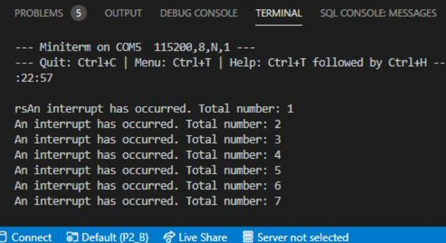

# **INFORME PRÀCTICA 2_2** #

## **CODI** ##
```c++
        #include <Arduino.h>
        #define LED 16

        volatile int interruptCounter;  
        int totalInterruptCounter;  
        hw_timer_t * timer = NULL;  
        portMUX_TYPE timerMux = portMUX_INITIALIZER_UNLOCKED;  

        void IRAM_ATTR onTimer() {
            portENTER_CRITICAL_ISR(&timerMux);
            interruptCounter++;
            portEXIT_CRITICAL_ISR(&timerMux);  
        }

        void setup() {
            Serial.begin(115200);
            timer = timerBegin(0, 80, true);
            timerAttachInterrupt(timer, &onTimer, true);
            timerAlarmWrite(timer, 1000000, true);
            timerAlarmEnable(timer);
        }

        void loop() {   
            if (interruptCounter > 0) {
            portENTER_CRITICAL(&timerMux);
            interruptCounter--;
            portEXIT_CRITICAL(&timerMux);
            totalInterruptCounter++;
            Serial.print("An interrupt as occurred. Total number: ");
            Serial.println(totalInterruptCounter);  
            }
        }
```

## **FUNCIONAMENT** ##
Per generar els resultats pel monitor, configurem el setup obrint la connexió *Serial.begin(115200)*.  

Inicialitzem un temporitzador amb el *timer=timerBegin(0,80,true)* i el vinculem a la funció que s'executa quan es fa la interrupció *timerAttachInterrupt()*.
Seguidament, fem servir la funció *timerAlarmWrite()* per especificar el valor del contador en el que es generarà la interrupció del temporitzador.
  
En cada bucle, comprovarem si la variable interruptCounter és més gran a 0, si és així el reduirem especificant que s'ha reconegut la interrupció.  

Finalment, també s'indicaran el número total de interrupcions realitzades.

## **SORTIDA DE LA TERMINAL** ##
