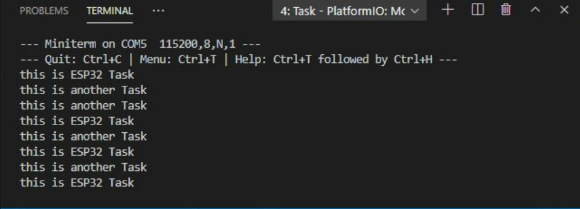

# **INFORME PRÀCTICA 4_1** #
## **CODI** ##
```c++
        #include <Arduino.h>

        void anotherTask(void * parameter);

        void setup(){
            
            Serial.begin(115200);  
            xTaskCreate(anotherTask, /* Task function. */  
            "another Task", /* name of task. */
            10000, /* Stack size of task */
            NULL, /* parameter of the task */
            1, /* priority of the task */
            NULL); /* Task handle to keep track of created task */  
        }  

        void loop(){
            
            Serial.println("this is ESP32 Task");
            delay(1000);
        }

        void anotherTask( void * parameter ){
            
            /* loop forever */
            for(;;){
            Serial.println("this is another Task");
            delay(1000);
            }
        /* delete a task when finish,
        this will never happen because this is infinity loop */  
        vTaskDelete( NULL );  
        }
```
## **FUNCIONAMENT** ##
Definim una la capçalera de la funció que crea la tasca anotherTask.  
Seguidament, en el setup(), executem el xTaskCreate per importar a la configuració del programa les propietats de la nostre tasca.  
En el loop(), tenim una instrucció per tal de que tregui per la terminal si s'ha executat la tasca correctament.  
Finalment, tenim un anotherTask que treu per pantalla que s'està executant una nova tasca i així infinitament fins que l'usuari interrompi el procès.  

## **SORTIDA TERMINAL** ##
