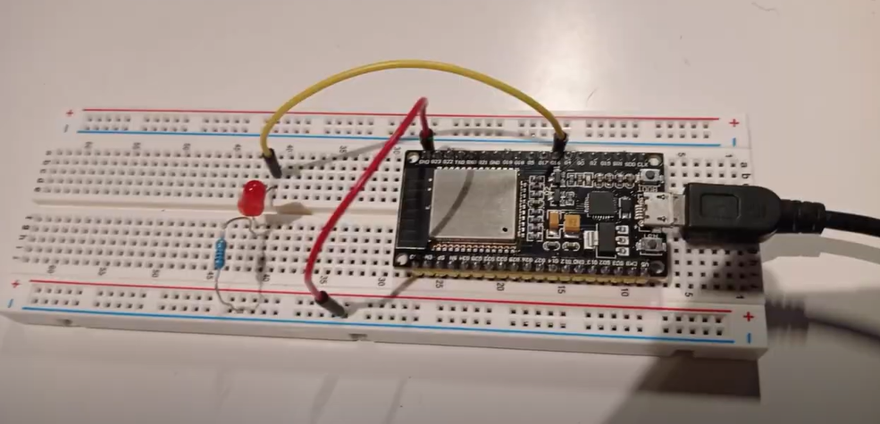

# **INFORME PRÀCTICA 4_2** #
## **CODI** ##
```c++
        #include <WiFi.h>  
        #include <ESPmDNS.h>  
        #include <WiFiUdp.h>  
        #include <ArduinoOTA.h>  

        const char* ssid = "Xiaomi_11T_Pro";  
        const char* password = "f5cbd8a82232";

        #define LED 16  
        String version ="Gis_1.0";  

        void Task1(void * parameter);  
        void anotherTask(void * parameter);  
        void Task2(void * parameter);  

        void setup(){
            Serial.begin(115200);
            xTaskCreate(anotherTask, "another Task",10000,NULL,1, NULL);
            xTaskCreate(Task1,"Task 1", 10000, NULL, 1,NULL);
            xTaskCreate(Task2, "Task 2", 10000, NULL, 1, NULL);
        }

        void loop(){
            Serial.println(version);
            Serial.println("this is ESP32 Task");
            delay(1000);
        }

        void anotherTask( void * parameter ){
            /* loop forever */
            for(;;){
                Serial.println("this is another Task");
                delay(1000);
            }
            vTaskDelete( NULL );
        }

        void Task1(void * parameter){
            pinMode(LED,OUTPUT);
            for(;;){
                delay(500);    
                digitalWrite(LED,HIGH);
                Serial.println("ON");
                delay(500);
                digitalWrite(LED,HIGH);
                Serial.println("OFF");
                digitalWrite(LED,LOW);
                delay(500);
            }
        }

        void Task2(void * parameter){
            Serial.begin(115200);
            Serial.println("Booting");
            WiFi.mode(WIFI_STA);
            WiFi.begin(ssid, password);
            while (WiFi.waitForConnectResult() != WL_CONNECTED) {
                Serial.println("Connection Failed! Rebooting...");
                delay(5000);
                ESP.restart();
            }

            ArduinoOTA.setHostname("Gis");

            ArduinoOTA
                .onStart([]() {
                String type;
                if (ArduinoOTA.getCommand() == U_FLASH)
                    type = "sketch";
                else // U_SPIFFS
                    type = "filesystem";

                // NOTE: if updating SPIFFS this would be the place to unmount SPIFFS using SPIFFS.end()
                Serial.println("Start updating " + type);
                })
                .onEnd([]() {
                Serial.println("\nEnd");
                })
                .onProgress([](unsigned int progress, unsigned int total) {
                Serial.printf("Progress: %u%%\r", (progress / (total / 100)));
                })
                .onError([](ota_error_t error) {
                Serial.printf("Error[%u]: ", error);
                if (error == OTA_AUTH_ERROR) Serial.println("Auth Failed");
                else if (error == OTA_BEGIN_ERROR) Serial.println("Begin Failed");
                else if (error == OTA_CONNECT_ERROR) Serial.println("Connect Failed");
                else if (error == OTA_RECEIVE_ERROR) Serial.println("Receive Failed");
                else if (error == OTA_END_ERROR) Serial.println("End Failed");
                });

            ArduinoOTA.begin();
            Serial.println("Ready");
            Serial.print("IP address: ");
            Serial.println(WiFi.localIP());

            for(;;){
                ArduinoOTA.handle();
            }
        }
```

## **FUNCIONAMENT** ###
En aquesta part de la pràctica, repetim l'ús de les dues tasques com la part anterior amb la diferència que pujem el codi a internet via OTA "Over The Air".

Per aquesta funcionalitat, hem agafat el projecte OTA de la següent pàgina web: "ESP32 Basic Over The Air (OTA) Programming In Arduino IDE".

## **FOTO DEL MONTATGE** ##

