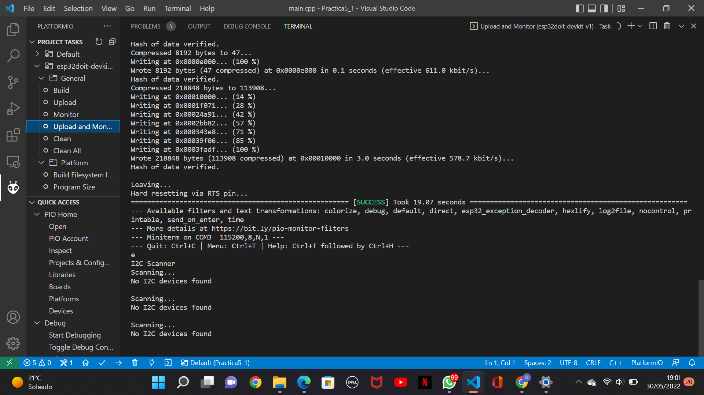

# **INFORME PRÀCTICA 5_1** #
## **CODI** ##
```c++
    #include <Arduino.h>  
    #include <Wire.h>

    void setup(){
        Wire.begin();
        Serial.begin(115200);
        while (!Serial); // Leonardo: wait for serial monitor
        Serial.println("\nI2C Scanner");
    }
    
    void loop(){
        byte error, address;
        int nDevices;
        Serial.println("Scanning...");
        nDevices = 0;
        for(address = 1; address < 127; address++ ){
            Wire.beginTransmission(address);
            error = Wire.endTransmission();
            if (error == 0){
                Serial.print("I2C device found at address 0x");
                if (address<16)
                    Serial.print("0");
                    Serial.print(address,HEX);
                    Serial.println(" !");
                    nDevices++;
            }
            else if (error==4){
                Serial.print("Unknown error at address 0x");
                if (address<16)
                    Serial.print("0");
                Serial.println(address,HEX);
            }
        }
        if (nDevices == 0)
            Serial.println("No I2C devices found\n");
        else
            Serial.println("done\n");
        delay(5000); // wait 5 seconds for next scan
    }
```

### **FUNCIONAMENT** ###
Es un programa que té la funció d'escanejar de forma periòdica, fins que l'usuari ho aturi, si hi ha algún perifèric I2C connectat al ESP32. Quan no ho detecta, envia un missatge a la terminal on diu: *"No I2C devices found\n"* i segueix escannejant. En canvi quan ho detecta, treu per la terminal l'adreça de la I2C i quan ha finalitzat envia un missatge dient: *"done\n"*.
### **FOTO** ###

