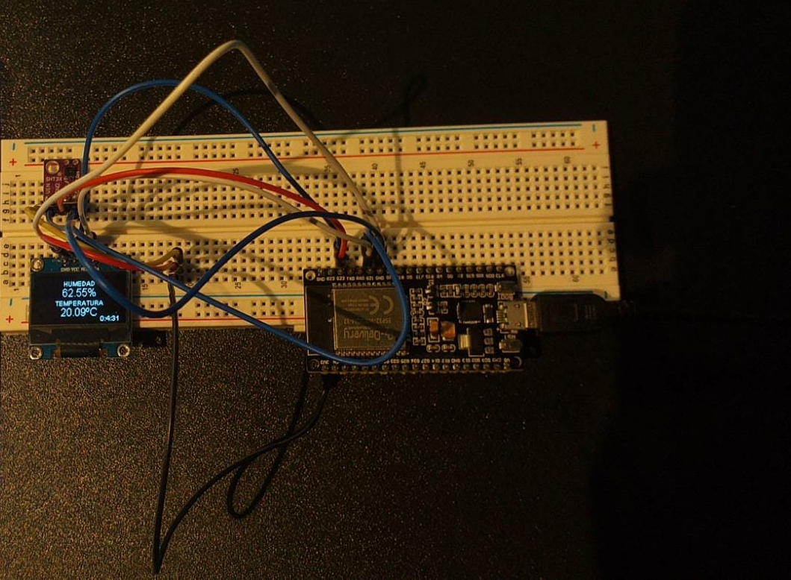

# **INFORME PRÀCTICA 5_2** #
### **CODI** ###
```c++
        #include <Arduino.h>
        #include "SSD1306Wire.h"   
        #include <Wire.h>
        #include "ClosedCube_SHT31D.h"
        #include "images.h"

        void init_temp_hum_task(void);

        SSD1306Wire display(0x3c, SDA, SCL);  
        ClosedCube_SHT31D sht3xd;

        #define DEMO_DURATION 3000
        typedef void (*Demo)(void);

        int demoMode = 0;
        int counter = 1;

        void setup()
        {
            Wire.begin();

        // Initialising the UI will init the display too.

            Serial.begin(115200);
            Serial.println("ClosedCube SHT3X-D Periodic Mode Example");
            Serial.println("supports SHT30-D, SHT31-D and SHT35-D");

            sht3xd.begin(0x44); // I2C address: 0x44 or 0x45

            Serial.print("Serial #");
            Serial.println(sht3xd.readSerialNumber());

            if (sht3xd.periodicStart(SHT3XD_REPEATABILITY_HIGH, SHT3XD_FREQUENCY_10HZ) != SHT3XD_NO_ERROR)
                Serial.println("[ERROR] Cannot start periodic mode");

        display.init();

        display.flipScreenVertically();
        display.setFont(ArialMT_Plain_10);
        }

        void loop()
        {
            SHT31D result = sht3xd.periodicFetchData();
        // draw the current demo method
        float humd = result.rh;
        float temp = result.t;

        Serial.print("Time:");
        Serial.print(millis());
        Serial.print(" Temperature:");
        Serial.print(temp, 1);
        Serial.print("C");
        Serial.print(" Humidity:");
        Serial.print(humd, 1);
        Serial.print("%");

        Serial.println();


        // clear the display
        display.clear();
        // draw the current demo method
        //demos[demoMode]();

        display.setTextAlignment(TEXT_ALIGN_CENTER);
        display.setFont(ArialMT_Plain_10);
        display.drawString(128/2, 0, "HUMEDAD");
        display.setFont(ArialMT_Plain_16);
        display.drawString(128/2, 11, String(humd)+ "%");
        display.setFont(ArialMT_Plain_10);
        display.drawString(128/2, 30, "TEMPERATURA");
        display.setFont(ArialMT_Plain_16);
        display.drawString(128/2, 41, String(temp)+ "ºC");

        display.setFont(ArialMT_Plain_10);
        display.setTextAlignment(TEXT_ALIGN_RIGHT);
        display.drawString(128, 54, String(millis()/3600000)+String(":")\
                +String((millis()/60000)%60)+String(":")\
                +String((millis()/1000)%(60)));

        // write the buffer to the display
        display.display();

        
        delay(100);

        }

        void printResult(String text, SHT31D result) {
            if (result.error == SHT3XD_NO_ERROR) {
                Serial.print(text);
                Serial.print(": T=");
                Serial.print(result.t);
                Serial.print("C, RH=");
                Serial.print(result.rh);
                Serial.println("%");
            } else {
                Serial.print(text);
                Serial.print(": [ERROR] Code #");
                Serial.println(result.error);
            }
        }
```
### **FUNCIONAMENT** ###
En aquesta part hem de posar a prova el I2C, i ho farem mitjançant un anàlisis de la temperatura i la humitat. Els dispositius que farem servir són ClosedCube_SHT31D (sensor de temperatura) i el SSD1306Wire (display), on també hem afegit les llibreries pertinents.
Dins del setup(), inicialitzem el sensor de temperatura definit anteriorment fora del setup() i establim el format del display *display.flipScreenVertically(); display.setFont(ArialMT_Plain_10);*  
En el loop(), definim una variable pel sensor de temperatura *SHT31D **result** = sht3xd.periodicFetchData();* i a partir d'aquesta variable podem treure els valors de la temperatura i de la humitat.  
Finalment, treiem els resultats per pantalla amb la funció *printResult* i també treiem els resultats pel display.


