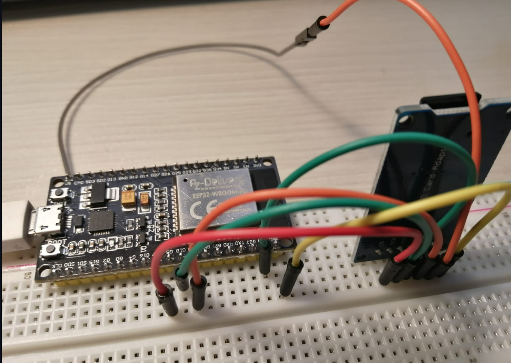

# **INFORME PRÀCTICA 6_1** #

## **CODI** ##
```c++
    #include <Arduino.h>
    #include <SPI.h>
    #include <SD.h>

    File myFile;

    void setup(){

        Serial.begin(9600);
        Serial.print("Iniciando SD ...");
        SPI.begin(18, 19, 23, 5); //Iniciamos el Bus SPI

        if (!SD.begin(5)) {
            Serial.println("No se pudo inicializar");
            return;
        }
        Serial.println("inicializacion exitosa");
        myFile = SD.open("/archivo.txt");//abrimos el archivo
        if (myFile) {

            Serial.println("archivo.txt");
            while (myFile.available()) {

            Serial.write(myFile.read());

            }
            myFile.close(); //cerramos el archivo
            } else {
            Serial.println("Error al abrir el archivo");

        }

    }
    void loop(){}
```

### **FUNCIONAMENT** ###
Aquest exercici consisteix en llegir les dades de memòria d'una targeta SD mitjançant busos SPI.

El còdi comença inicialitzant el bus SPI, codificat, en aquest cas,  en VSPI. Una vegada  inicialitzat, crearem la variable "*myFile*", on la seva funció és obrir el contingut de la SD, un fitxer de text, per exemple. Si tot funciona correctament, posteriorment es treu per terminal el contingut de l'arxiu de text, sinó, ens apareixerà per pantalla un missatge d'error

### **IMATGE DEL MONTATGE** ###


