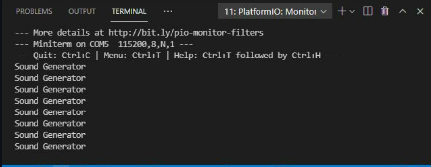

# **INFORME PRÀCTICA 7_1** #

## **CODI** ##
```c++
#include "Arduino.h"
#include "FS.h"
#include "HTTPClient.h"
#include "SPIFFS.h"
#include "SD.h"
#include "SPI.h"
#include "AudioGeneratorAAC.h"
#include "AudioOutputI2S.h"
#include "AudioFileSourcePROGMEM.h"
#include "sampleaac.h"

AudioFileSourcePROGMEM *in;
AudioGeneratorAAC *aac;
AudioOutputI2S *out;

void setup(){

  Serial.begin(115200);
  in = new AudioFileSourcePROGMEM(sampleaac, sizeof(sampleaac));
  aac = new AudioGeneratorAAC();
  out = new AudioOutputI2S();
  out -> SetGain(0.125);
  out -> SetPinout(26,25,22);
  aac->begin(in, out);

}

void loop(){

  if (aac->isRunning()) {
    aac->loop();
    } 
  else {
      aac -> stop();
      Serial.printf("Sound Generator\n");
      delay(1000);
  }
}
```

## **FUNCIONAMENT** ##
En aquest apartat de la pràctica 7, es treballa amb dades de so que s'emmagatzemen com una matriu en la RAM interna del ESP32. Per decodificar aquestes dades d'àudio digitals a una senyal analògixa que es pugui reproduïr mitjançant un altaveu, s'utilitza la placa MAX98357 amb protocol I2S.  
El còdi comença amb les definicions de les llibreries necessaries en aquest cas i, de 3 variables relacionades amb el àudio(in, aac, out).


En el setup(), inicialitzarem el *Serial* i li assignarem a la variable *in* la següent linia: *"new AudioFileSourcePROGMEM(sampleaac, sizeof(sampleaac))"*, que importa el arxiu d'àudio i el seu tamany. A la variable *aac*, se li assigna *"new AudioGeneratorAAC()"* per poder decodificar l'àudio en format ".aac". Per l'altre banda, a la variable *out* se li assigna *"new AudioOutputI2S()"*, que utiliza el protocol I2S per poder establir el guany d'àudio i els pins de sortida, tal i com es mostra més tard. La linia *"aac->begin(in, out)"* relaciona l'entrada amb la sortida.

En el loop(), per començar, si el bucle corre, el *aac* decodifica. Si, pel contrari, el bucle no corre, el *aac* deixa de decodificar i apareix pel terminal la linia "Sound Generator".

## **FOTO TERMINAL** ##

