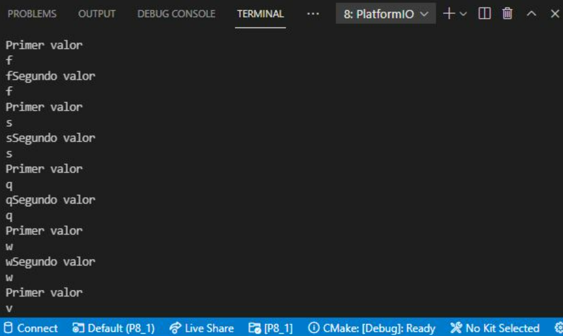

# **INFORME PRÀCTICA 8** #
## **CODI** ##
```c++
        #include <Arduino.h>

        char valor;
        char valor2;

        void setup() {
            Serial.begin(115200);
            Serial2.begin(115200);
        }

        void loop() {
            if(Serial.available()){
                valor = Serial.read();
                Serial.println("Primer valor");
                Serial2.write(valor);

                delay(2);

                if(Serial2.available()){
                    Serial.println("Segundo valor");
                    valor2 = Serial2.read();
                    Serial.write(valor2);
                }
            }
        }
```

## **FUNCIONAMENT** ##
Per començar, definim dues variables: *char valor*: que aquesta serà el caràcter que reb el uart0 i que posteriorment transmet el uart2, i el *char valor2*: que reb el uart2 i que transfereix el uart0.  
En el setup(), inicialitzem un Serial per els uart0 i un Serial2 per els uart2.  
Finalment, creem un bucle de comunicació uart dins del loop():
Mitjançant un condicional diem que, si el uart0 està disponible, que llegeixi el *valor* i que el uart2 ho transmeti i es mostri per terminal. Posteriorment, si el uart2 està disponible, que llegeixi el *valor2* i que el uart0 ho transmeti i es mostri per la terminal. I amb això es crea el bucle de comunicació uart2.

## **IMATGE DEL RESULTAT PER TERMINAL** ###
